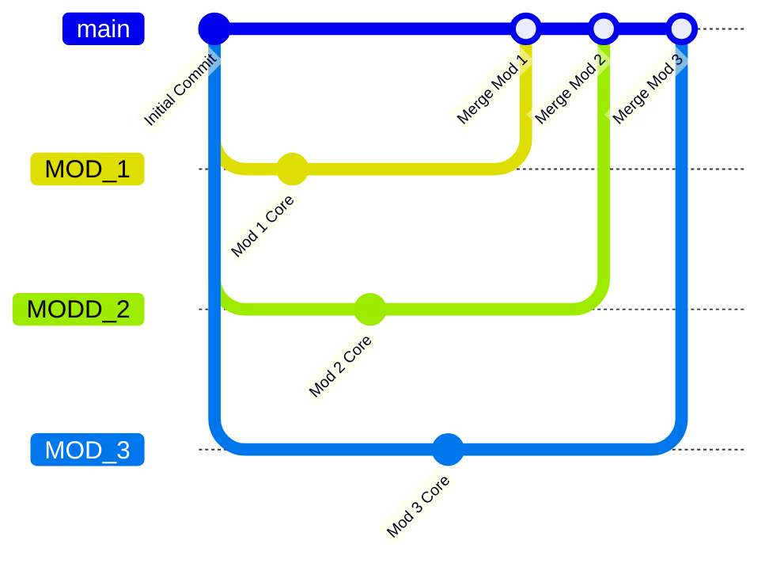

# Git Branching & Collaboration Workflow for `sih_mining`

This document defines the Git branching strategy and collaboration workflow for the **`sih_mining`** repository.

---

## 📌 Branch Architecture



| Branch | Purpose | Base Branch |
| :--- | :--- | :--- |
| `main` | Production-ready integrated application | - |
| `MOD_1` | Development branch for Module 1 | `main` |
| `MODD_2` | Development branch for Module 2 | `main` |
| `MOD_3` | Development branch for Module 3 | `main` |
| `feature/*` | Individual feature work for a module | `MOD_1`, `MODD_2`, or `MOD_3` |

---

## 🚀 Daily Developer Workflow

### 1. Working on Module 1 (`MOD_1`)

```bash
# Switch to Module 1 branch and sync latest changes
git checkout MOD_1
git pull origin MOD_1

# (Optional) Create a feature branch for your specific feature
git checkout -b feature/mod1-feature-name

# Make changes, then commit
git add .
git commit -m "feat(mod1): description of your changes"

# Push to GitHub
git push origin feature/mod1-feature-name
```

### 2. Working on Module 2 (`MODD_2`)

```bash
git checkout MODD_2
git pull origin MODD_2
git checkout -b feature/mod2-feature-name

# Make changes, then commit
git add .
git commit -m "feat(mod2): description of your changes"

# Push to GitHub
git push origin feature/mod2-feature-name
```

### 3. Working on Module 3 (`MOD_3`)

```bash
git checkout MOD_3
git pull origin MOD_3
git checkout -b feature/mod3-feature-name

# Make changes, then commit
git add .
git commit -m "feat(mod3): description of your changes"

# Push to GitHub
git push origin feature/mod3-feature-name
```

---

## 🔀 Merging & Integration Protocol

1. **Feature -> Module Branch**: Submit a Pull Request (PR) from `feature/modX-...` into the target module branch (`MOD_1`, `MODD_2`, or `MOD_3`).
2. **Module Branch -> Main Branch**: Once a module milestone is tested and verified, open a PR to merge `MOD_1`, `MODD_2`, or `MOD_3` into `main`.

---

## ⚙️ Automated CI/CD Check

Every push or PR to `main`, `MOD_1`, `MODD_2`, or `MOD_3` automatically triggers GitHub Actions (`.github/workflows/ci.yml`) to validate code integrity.
